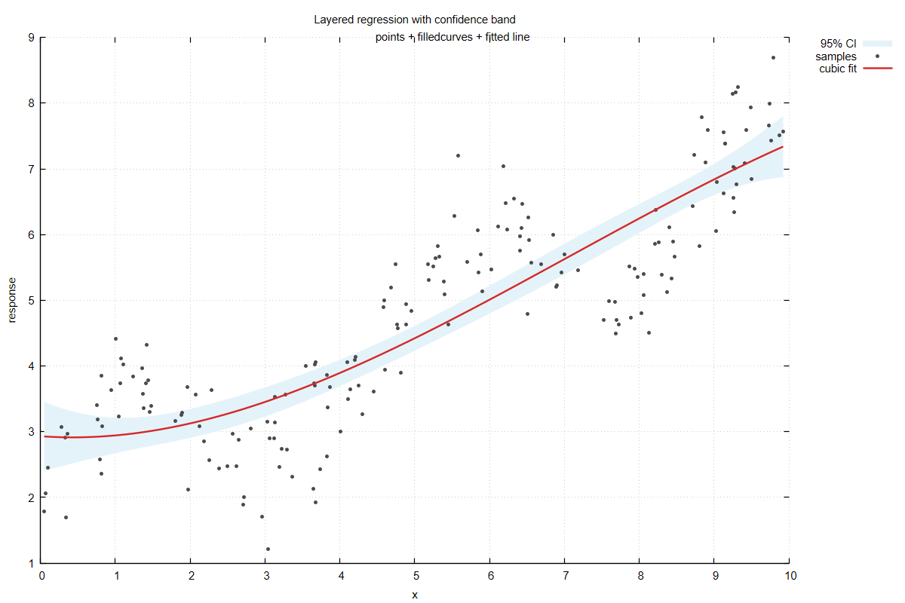
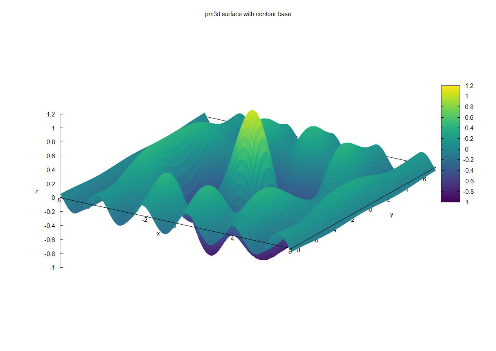
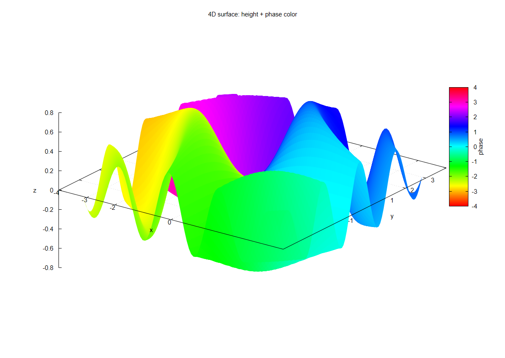
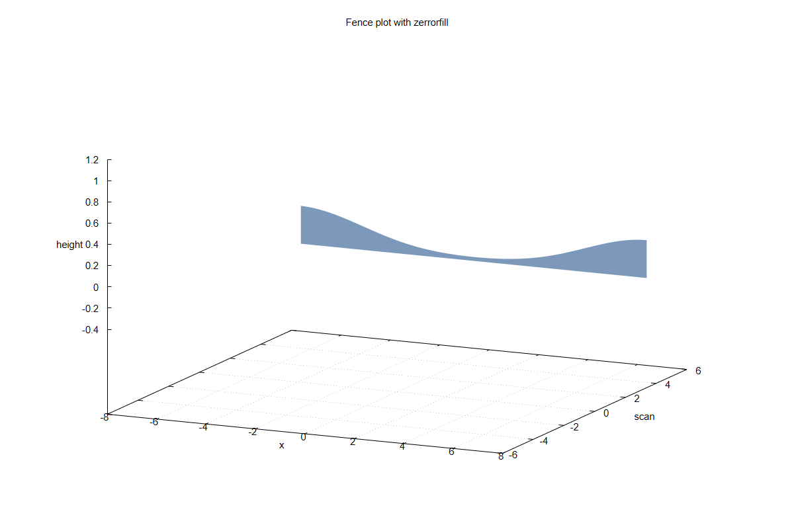
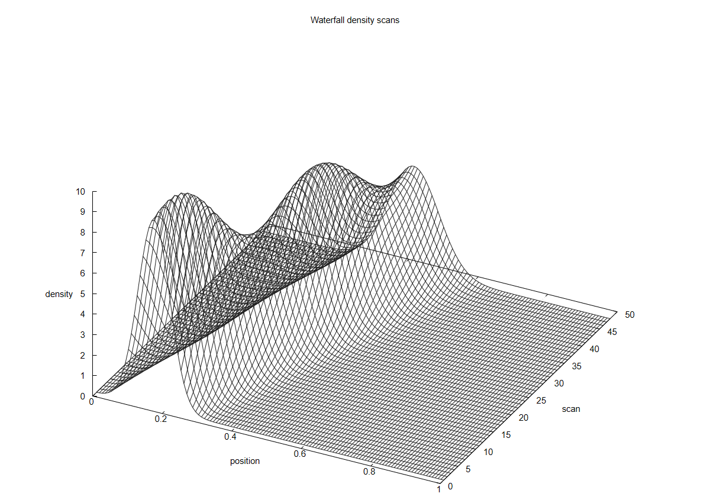
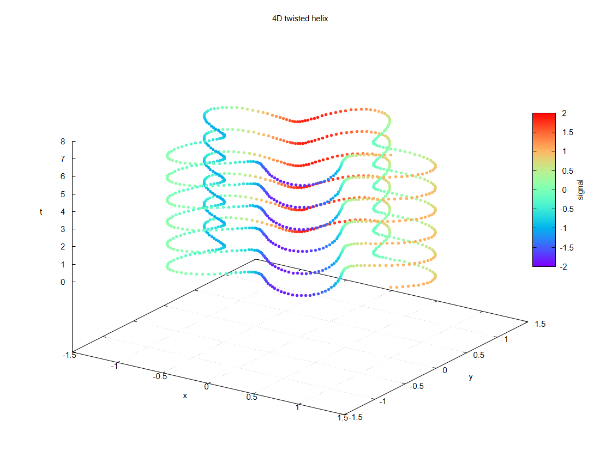
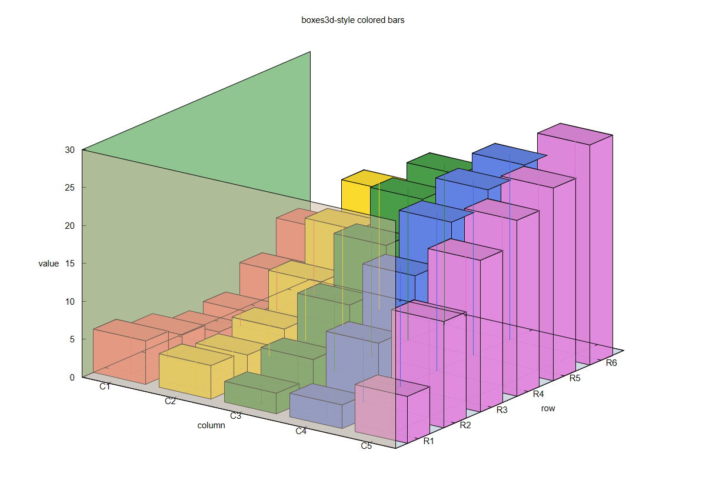

# gunplotR

[](https://github.com/zsrnog/gunplotR/actions/workflows/R-CMD-check.yaml)
[](LICENSE)
[](http://www.gnuplot.info/)
[](https://www.r-project.org/)

`gunplotR` is an R interface to the external `gnuplot` plotting program. It
writes R data to temporary files, generates gnuplot scripts, and renders 2D,
3D, and 4D graphics with R-style arguments.

The package is designed for users who want the power of gnuplot without
leaving R:

- R-like aesthetics: `col`, `lwd`, `lty`, `pch`, `cex`, fonts, labels, and legends.
- Layered plotting with `gp_layer()` and `gp_multi()`.
- 3D and 4D wrappers for surfaces, pm3d maps, point clouds, vectors, polygons,
  voxels, isosurfaces, fence plots, waterfall plots, and boxes3d-style bars.
- Broad gnuplot 6 mapping through `gp_options()`, `gp_terminal()`,
  `gp_linetype()`, `gp_linestyle()`, and `gp_arrowstyle()`.
- Default behavior previews plots interactively and does not save files unless
  `output =` is supplied.

## Installation

Install from GitHub after publishing:

```r
install.packages("remotes")
remotes::install_github("zsrnog/gunplotR")
```

Or install the local source package:

```r
install.packages(
  "C:/Users/zsr/Documents/gunplotR/gunplotR_0.1.0.tar.gz",
  repos = NULL,
  type = "source"
)
```

`gunplotR` requires an external gnuplot executable. On Windows:

```powershell
winget install -e --id gnuplot.gnuplot
```

If gnuplot is not on `PATH`, configure it in R:

```r
options(gunplotR.bin = "C:/Program Files/gnuplot/bin/gnuplot.exe")
```

## Quick Start

```r
library(gunplotR)

x <- seq(0, 2 * pi, length.out = 300)

gp_line(
  x,
  sin(x),
  col = 4,
  lwd = 2,
  main = "Sine wave",
  xlab = "x",
  ylab = "sin(x)"
)
```

Save a file only when requested:

```r
gp_line(x, sin(x), output = "sine.png", preview = FALSE)
```

## R-Style Access to Gnuplot 6

`gp_options()` maps common gnuplot `set` commands into R-friendly arguments.

```r
gp_line(
  1:100,
  (1:100)^2,
  settings = gp_options(
    xlog = TRUE,
    ylog = TRUE,
    xtics = c(1, 10, 100),
    yformat = "%.0e",
    key = "outside right",
    style_fill = "solid 0.4 border lc black"
  ),
  terminal = gp_terminal("pngcairo", width = 1200, height = 800,
                         font = "Arial", font_size = 12)
)
```

## Gallery

The examples below were generated with
[`inst/examples/deep_gallery.R`](inst/examples/deep_gallery.R). The full image
set is saved in [`gallery/deep_potential`](gallery/deep_potential).

### Layered 2D Plot

```r
gp_multi(
  gp_layer(data = band, using = "1:2:3", style = "filledcurves",
           title = "95% CI", fill = 0.24, fill_col = "#8ecae6",
           border = FALSE),
  gp_layer(data = raw, using = "1:2", style = "points",
           title = "samples", pch = 7, cex = 0.65),
  gp_layer(data = line, using = "1:2", style = "lines",
           title = "cubic fit", col = "#d62828", lwd = 2.4)
)
```



### 3D pm3d Surface

```r
gp_surface(
  surf_fun,
  type = "pm3d",
  settings = gp_options(
    view = c(58, 32),
    palette = "viridis",
    contour = "base",
    colorbox = TRUE
  )
)
```



### 4D Surface

```r
gp_surface4d(
  z,
  color,
  palette = "model HSV defined (0 0 1 1, 1 1 1 1)",
  cblabel = "phase",
  view = c(57, 36)
)
```



### Fence and Waterfall Plots





### 4D Point Cloud and 3D Bars





## Main Functions

- `gp_plot()`, `gp_line()`, `gp_scatter()`: base 2D plotting.
- `gp_function()`: plot gnuplot expressions.
- `gp_style()`, `gp_layer()`, `gp_multi()`: layered graphics with gnuplot styles.
- `gp_options()`, `gp_terminal()`: gnuplot 6 settings using R-style arguments.
- `gp_surface()`, `gp_surface4d()`, `gp_map3d()`: 3D and 4D surfaces.
- `gp_points3d()`, `gp_points4d()`: 3D and 4D point clouds.
- `gp_bar3d()`, `gp_fenceplot()`, `gp_waterfall()`: specialized 3D demos.
- `gp_gantt()`, `gp_violinplot()`: complex 2D statistical and schedule plots.
- `gp_run()`: run raw gnuplot scripts when you need total control.

## Documentation

- [USAGE_GUIDE.md](USAGE_GUIDE.md): user guide in Chinese.
- [PLOT_AESTHETICS.md](PLOT_AESTHETICS.md): R-style aesthetics.
- [GNUPLOT_FEATURE_MAP.md](GNUPLOT_FEATURE_MAP.md): gnuplot 6 to R argument mapping.
- [THREE_D_FOUR_D_PLOTS.md](THREE_D_FOUR_D_PLOTS.md): 3D and 4D examples.
- [COMPLEX_PLOTS.md](COMPLEX_PLOTS.md): complex layered examples.

## Author

Zhou Shirong  
<zsrnog@yeah.net>

## License

MIT.
